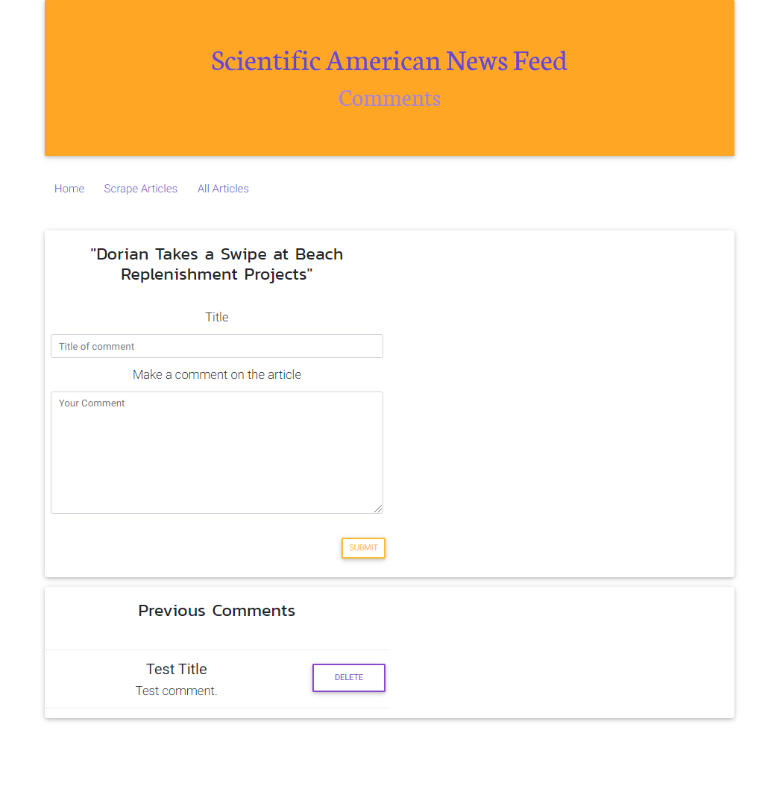

# mongo-scraping
---------------
## Table of Contents
1. [Abstract](#abstract)
2. [Coding Overview](#overview)
3. [Application Display](#display)

## Abstract

Application basically allows user to scrape the latest news from Scientific American News site and they can view or delete from their database and also leave comments or delete their comments on the latest news.

## Coding Overview

The application is built with;
* Handlebars
* Express.js
* Mangoose
* Node.js
* Cheerio
* Axios
* Mongo.DB
* CSS
* JavaScript
* jQuery

Install locally to see the website:
### `git clone git@github.com:pinargultekin/mongo-scraping.git`
### `cd mongo-scraping`
### `npm install`
### `nodemon server.js` or `npm start`

## Application Display

 

 
